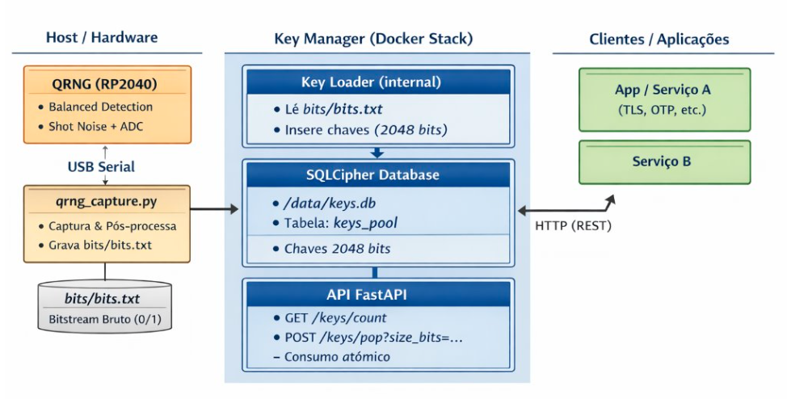

# QRNG Key Manager (FastAPI + SQLite/SQLCipher)

Gerenciador de chaves geradas por QRNG (Quantum Random Number Generator), com:

* API REST em **FastAPI**
* Banco local **SQLite criptografado com SQLCipher**
* Extração de chaves a partir de arquivos de bits (`bits.txt`)
* Consumo (pop) de chaves de forma **atomicamente segura**
* Suporte a slices de tamanho variável (`size_bits`), consumindo a chave inteira
* Execução isolada em **Docker compose** com **Docker secrets**
* Loader interno que popula o banco diretamente **dentro do container**, garantindo compatibilidade de SQLCipher

---

## Origem dos bits (QRNG – TII 2024)

Os bits utilizados por este sistema são extraídos de um **Quantum Random Number Generator (QRNG)** baseado em *balanced detection of shot noise*, conforme descrito no artigo:

**A Compact Quantum Random Number Generator Based on Balanced Detection of Shot Noise**
Jaideep Singh et al., Technology Innovation Institute (TII), 2024
[https://arxiv.org/pdf/2409.20515](https://arxiv.org/pdf/2409.20515)

Esse QRNG opera com detecção balanceada para isolar shot noise quântico, produzindo entropia física robusta (QCNR > 30 dB). As amostras são adquiridas via USB e pós-processadas (Toeplitz hashing), servindo como base para geração das chaves de 2048 bits usadas neste sistema.

Para detalhes sobre **captura, comunicação com o RP2040**, consulte:

📎 **Documentação complementar do módulo de captura**
[`qrng_capture/README.md`](./qrng_capture/README.md)

---

## 📁 Estrutura do Projeto

```
qrng-sqlcipher/
├── api/
│   ├── db.py              # Conexão SQLCipher + schema
│   ├── main.py            # FastAPI (keys/count, keys/pop)
│   ├── metrics.py         # Utilidades de bitstreams
│   └── __init__.py
│
├── tools/
│   └── loader_from_file_sqlcipher.py   # Loader para bits.txt → keys.db
│
├── qrng_capture/         # Captura direta do RP2040
│   ├── qrng_capture.py   # Script de captura de bits e pós-processamento
│   └── README.md         # Documentação da captura
│
├── bits/                  # Pasta para colocar bits.txt (volume do loader)
│   └── bits.txt
│
├── data/                  # Banco persistente (montado como volume)
│   └── keys.db
│
├── db_key.secret          # Senha SQLCipher (Docker secret) — NÃO versionar!
├── .env                   # Configuração da API
├── docker-compose.yml
├── Dockerfile
└── README.md
```

---

## 🔐 Arquitetura do Sistema

A figura abaixo apresenta a arquitetura completa do **QRNG Key Manager**, desde a captura de entropia quântica no hardware até o consumo das chaves pelas aplicações clientes.



**Fluxo resumido:**
1. O QRNG baseado em RP2040 gera bits quânticos via balanced detection de shot noise.
2. O script `qrng_capture.py` captura, pós-processa e grava o bitstream bruto.
3. O *Key Loader* insere chaves de 2048 bits no banco SQLCipher.
4. A API FastAPI fornece chaves via REST com consumo atômico.
5. Aplicações clientes consomem chaves para TLS, OTP ou outros mecanismos criptográficos.


#### Banco de dados – SQLite + SQLCipher

* Armazenado em `./data/keys.db`
* Criptografado com **SQLCipher**
* Senha lida de um **Docker secret** montado como `/run/secrets/db_key`

#### Tabela principal: `keys_pool`

```sql
CREATE TABLE IF NOT EXISTS keys_pool (
  id          INTEGER PRIMARY KEY AUTOINCREMENT,
  key_hex     TEXT    NOT NULL,   -- chave completa de 2048 bits (512 hex chars)
  h_min       REAL    NOT NULL,   -- min-entropy do batch
  h_shannon   REAL    NOT NULL,   -- entropia de Shannon do batch
  created_at  TEXT    NOT NULL DEFAULT (datetime('now')),
  consumed    INTEGER NOT NULL DEFAULT 0
);
```

> Cada linha representa **uma chave completa de 2048 bits**.
> Quando usada (mesmo parcialmente), é **deletada** do banco.

---

## 📘 Implantação do Ambiente

### 1. Criação das pastas necessárias

```bash
mkdir -p data bits
```

### 2. Criação do arquivo de segredo criptográfico (SQLCipher)

```bash
echo -n 'SENHA_FORTE_SEM_ASPAS' > db_key.secret
```

> **Observações:**
>
> * Não utilizar aspas `'` dentro da senha.
> * Evitar espaços e quebras de linha.
> * **Nunca versionar este arquivo no Git ou em qualquer repositório.**

### 3. Definição das variáveis de ambiente

Criar o arquivo `.env` com o seguinte conteúdo:

```dotenv
DB_PATH=/data/keys.db
DB_KEYFILE=/run/secrets/db_key
API_PORT=8081
UVICORN_WORKERS=1
```

### 4. Ajuste de permissões para os diretórios *data* e *bits*

Caso o container seja executado sob o usuário de UID **1000** (configuração comum em ambientes Docker), ajustar permissões no host:

```bash
mkdir -p data bits
chown -R 1000:1000 data bits
chmod -R 755 data bits
```

Esse procedimento assegura que o processo interno do container terá acesso apropriado para criação e escrita no banco SQLCipher.

### 5. Inserção do arquivo de bits

Copiar o arquivo contendo a sequência bruta de bits:

```bash
cp caminho/para/seu/bits.txt bits/bits.txt
```

### 6. Construção das imagens Docker

```bash
docker compose build
```

### 7. População inicial do banco utilizando o *loader*

Executar:

```bash
docker compose run --rm loader
```

Saída esperada:

```
OK: chaves inseridas=30 | H_min(batch)=0.999xxx | H_shannon(batch)=0.999xxx
```

Após isso, o arquivo `data/keys.db` estará devidamente criado e criptografado via SQLCipher.

### 8. Inicialização do serviço da API

```bash
docker compose up -d api
```

### 9. Verificação operacional

```bash
curl http://localhost:8081/keys/count
```

Se o banco estiver populado, o retorno deverá indicar a quantidade de chaves disponíveis.


---

## 🧩 Endpoints da API

### GET `/keys/count`

Retorna o número de chaves ainda disponíveis:

```
GET /keys/count
```

Resposta:

```json
{ "available": 30 }
```

---

### POST `/keys/pop?size_bits=...`

Entrega uma **fatia** da chave de 2048 bits (ex.: 256/1024/2048 bits), mas **remove a chave inteira do banco** após o uso.

#### Exemplo 2048 bits (chave completa)

```bash
curl -X POST "http://localhost:8081/keys/pop?size_bits=2048"
```

#### Exemplo 256 bits (somente slice, mas consome a chave inteira)

```bash
curl -X POST "http://localhost:8081/keys/pop?size_bits=256"
```

#### Resposta típica

```json
{
  "key_id": 1,
  "slice_hex": "ab12cd34...",
  "size_bits": 256,
  "h_min": 0.99876,
  "h_shannon": 0.99912,
  "slice_b64": "qxs9..."
}
```

---

## 🔄 Carregar novas chaves sem apagar as antigas

Se você tiver um novo arquivo de bits (`bits_315k.txt`) com, por exemplo, **315000 bits**:

1. Copie para o volume:

```bash
cp bits_315k.txt bits/bits.txt
```

2. Rode o loader novamente:

```bash
docker compose run --rm loader
```

Ele irá:

* Ler todos os bits
* Gerar quantas chaves de 2048 bits forem possíveis
  (315000 bits → 153 chaves completas)
* Inserir **novas** linhas em `keys_pool`
* **Não** mexer nas chaves antigas

Verificar:

```bash
curl http://localhost:8081/keys/count
```

---

## 🧪 Exemplos de uso

```bash
# Ver quantas chaves existem
curl http://localhost:8081/keys/count

# Consumir uma chave inteira
curl -X POST "http://localhost:8081/keys/pop?size_bits=2048"

# Consumir apenas 256 bits (mas a chave inteira é deletada)
curl -X POST "http://localhost:8081/keys/pop?size_bits=256"

# Ver quantas sobram
curl http://localhost:8081/keys/count
```

---

## 🛠️ Troubleshooting

#### ❌ Erro: "file is not a database"

Causa mais comum:

* O banco foi criado no host e não dentro do container → engines SQLCipher diferentes.

**Solução:** recrie o banco dentro do container:

```bash
docker compose down
rm -f data/keys.db
docker compose run --rm loader
docker compose up -d api
```

---

#### ❌ Erro: "cannot commit – no transaction is active"

Use a versão atualizada de `tx_immediate` em `api/db.py` (já incluída neste repo):

```python
if getattr(con, "in_transaction", False):
    con.commit()
```

---

#### ❌ Nada retorna no `pop`

Significa que não há chaves disponíveis:

```json
HTTP 404
{"detail": "Sem chaves disponíveis no pool para o tamanho solicitado."}
```

Carregue novas chaves:

```bash
docker compose run --rm loader
```

---

## 📦 Tecnologias utilizadas

* Python 3.12
* FastAPI
* SQLite + SQLCipher (via `pysqlcipher3`)
* Docker + Docker Compose
* Docker Secrets
* Entropia: H_min e H_shannon calculadas no batch

---

<div style="display:flex; align-items:center; gap:12px; padding:12px 0;">
  
  <div>
    <strong>Projeto QUIIN – Quantum Industrial Innovation</strong><br>
    <a href="https://quiin.senaicimatec.com.br/">https://quiin.senaicimatec.com.br/</a>
  </div>
</div>